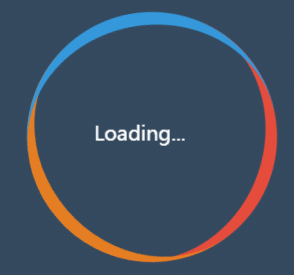
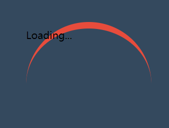
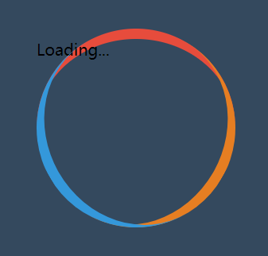
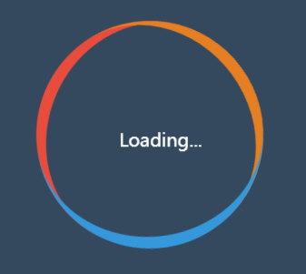
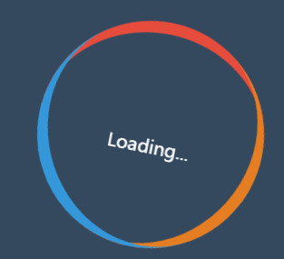

## GitHub 地址 & 效果预览

[GitHub 地址](https://github.com/UESTCzhouyuchuan/CSS/tree/master/Loading/Amazing%20Loading%20Animation)

效果预览：



## HTML 结构

很简单，一个`class`为`loading`的`div`套着一个`span`,`span`里面是文字 loading...。

```
<div class="loading">
  <span>Loading...</span>
</div>
```

## CSS 是重点

接下来一步一步讲解 css 的实现。

### 第一步，先实现小月牙。

效果：。
实现方法很简单：

- 首先把`.loading`元素变成一个圆形，通过`border-radius: 50%;`实现。
- 然后为`.loading`元素设置上边框，就可实现月牙形状。

CSS 代码：

```
.loading {
	position: relative;
	width: 200px;
	height: 200px;
	box-sizing: border-box;
	border-radius: 50%;
	-webkit-border-radius: 50%;
	-moz-border-radius: 50%;
	-ms-border-radius: 50%;
	-o-border-radius: 50%;
	border-top: 10px solid #e74c3c;
}
```

### 第二步，把剩下两个小月牙画出来

有了第一个月牙，第二三个就简单了，使用伪类`::after` `::before`以同样的方式画出月牙，再通过`rotate`旋转即可。

CSS 代码：

```
.loading::before,
.loading::after {
	content: "";
	position: absolute;
	top: -10px;
	left: 0;
	width: 200px;
	height: 200px;
	box-sizing: border-box;
	border-radius: 50%;
	-webkit-border-radius: 50%;
	-moz-border-radius: 50%;
	-ms-border-radius: 50%;
	-o-border-radius: 50%;
}
.loading::before {
	border-top: 10px solid #e67e22;
	transform: rotate(120deg);
	-webkit-transform: rotate(120deg);
	-moz-transform: rotate(120deg);
	-ms-transform: rotate(120deg);
	-o-transform: rotate(120deg);
}
.loading::after {
	border-top: 10px solid #3498db;
	transform: rotate(240deg);
	-webkit-transform: rotate(240deg);
	-moz-transform: rotate(240deg);
	-ms-transform: rotate(240deg);
	-o-transform: rotate(240deg);
}
```

效果：



### 第三步，loading 文字垂直居中

垂直居中的方法很多，这里使用绝对定位+`text-align`+`line-height`的方式。

为什么用这个笨方法，这里先卖个关子。

CSS 代码：

```
.loading span {
	position: absolute;
	height: 200px;
	width: 200px;
	line-height: 200px;
	display: block;
	color: #fff;
	text-align: center;
}
```

到这里，效果就封面的一样了，是静态的



### 第四步，加上动画

#### 外部 div 的动画

外部 div，很显然是顺时针旋转 360deg，学过`animation`的同学很容易去实现它。

CSS 代码：

```
.loading {
	animation: circle 2s linear infinite;
	-webkit-animation: loading1 2s linear infinite;
}
@keyframes loading1 {
	to {
		transform: rotate(360deg);
		-webkit-transform: rotate(360deg);
		-moz-transform: rotate(360deg);
		-ms-transform: rotate(360deg);
		-o-transform: rotate(360deg);
	}
}
```

这时，效果是这样的：



会发现，内部的`span`即文字会随着外部一同旋转，这不是我们想要的效果。怎么办呢？咱们想要`loading...`文字*不动*。

大家应该知道相对运动，外部`div`顺时针旋转，那么内部的`span`逆时针旋转，这不就达到了`span`看起来*不动*呀。

#### 内部 span 的动画。

内部`span`逆着外部`div`转，即逆时针旋转。

在这可以解答前面卖的关子，为什么 span 实现垂直居中是使用绝对定位+`text-align`+`line-height`的方式。原因是为了让 span 和外部 div 一样大，这样就能实现`span`看着*不动*的效果。

CSS 代码:

```
.loading span {
	animation: loading2 2s linear infinite;
	-webkit-animation: loading2 2s linear infinite;
}
@keyframes loading2 {
	to {
		transform: rotate(-360deg);
		-webkit-transform: rotate(-360deg);
		-moz-transform: rotate(-360deg);
		-ms-transform: rotate(-360deg);
		-o-transform: rotate(-360deg);
	}
}
```

最终效果：


完整代码在 GitHub 上，地址：

<https://github.com/UESTCzhouyuchuan/CSS/tree/master/Loading/Amazing%20Loading%20Animation>

---

## 完。
