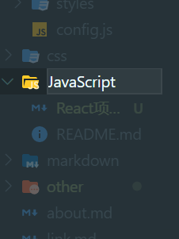
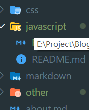
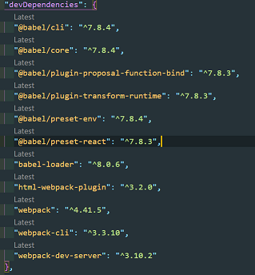

## 写在前面之今日踩坑

现在是 21:03，这篇文章还没写一个字就已经浪费了半个小时，踩了一个 vuepress 的坑，分类文件夹不能使用大学英文字符，必须一律小写，否则对于 blog 显示空白页，刷新后 404 页面。

例如：前者分类命名是错误的，必须改成小写。




废话不多说，直接进入正题。

## 前言

之前面试的时候，无论是腾讯、字节还是网易，鄙人都被问到一个问题，**你的 vue 项目是用的脚手架还是自己配置的？**,甚至夺命连环问**了解 webpack** 、**会用 webpack 吗？**。

故，今天，就是要好好**了解**怎么配置 webpack，以新学的地 React 为例，主要有 webpack.config.js、webpack 官方和第三方插件、webpack 的基本命令这几部分。

## webpack4.x 基本配置

首先，新建一个 React 项目目录，目录名就记为 React。

然后第二步，创建基本的目录结构

1. `npm init -y` 创建包管理文件`package.json`
2. 创建`src`文件夹，存放项目源码
3. `src`文件里面创建`index.js`以及`index.html`文件
4. 创建 dist 文件夹，作为项目打包后的文件夹
5. 创建`webpack.config.js`文件,作为 webpack 的配置文件

第三步，装基本包，主要有 webpack,webpack-cli,webpack-dev-server,html-webpack-plugin

1. webpack 和 webpack-cli 是基本包。
2. webpack-dev-server 作用是热更新，实时打包。
3. html-webpack-plugin 作用是把页面结果展示出来。

在命令行运行命令`npm install -D webpack webpack-cli webpack-dev-server html-webpack-plugin`。

包管理文件中的`devDependencies`应该如下所示

```
"devDependencies": {
		"html-webpack-plugin": "^3.2.0",
		"webpack": "^4.41.5",
		"webpack-cli": "^3.3.10",
		"webpack-dev-server": "^3.10.2"
	}
```

第四步，为`npm`添加脚本命令`dev`,

```
"scripts": {
		"test": "echo \"Error: no test specified\" && exit 1",
		"build": "webpack", // 打包时命令
		"dev": "webpack-dev-server --open firefox --port 2233 --hot" // 开发时
	},
```

第五步，修改`webpack`的配置文件。

```
const path = require("path");
const htmlWebpackPlugin = require("html-webpack-plugin");
// 新建插件实例
const htmlPlugin = new htmlWebpackPlugin({
	template: path.join(__dirname, "./src/index.html"), // 目标文件
	filename: "index.html", //生成的文件
});
module.exports = {
	// Node的模块化语法，webpack是基于Node构建的，es6的是export default
	mode: "development", // 开发环境和生产环境，development,production
	entry: "./src/index.js", // 默认入口文件，可以不用写，减少配置文件体积,默认输出文件是./dist/main.js

	plugins: [htmlPlugin],
	module: {
		//第三方插件
		rules: [
			{ test: /\.js|jsx$/, use: "babel-loader", exclude: /node_modules/ },
		],
	},
	resolve: {
		extensions: [".js", ".jsx", ".html"], // 添加文件扩展名
		alias: {
			"@": path.join(__dirname, "./src"), // 源代码根目录别名
		},
	},
};


```

## 接下里是 React 部分

### 装 React 的基本包

使用命令`npm install -S react react-dom react-scripts`,-S 表示生产环境也需要使用。

```
"dependencies": {
    "react": "^16.12.0",
    "react-dom": "^16.12.0",
    "react-scripts": "3.3.1"
  },
```

### 不适用脚手架在 js 中使用 jsx 语法

- 安装 babel

  **注意**：`babel 6.x`和`babel 7.x`版本是不兼容的所以一定统一版本,`@babel/`是 babel7 版本的写法。

```
npm install -D @babel/core babel-loader @babel/plugin-transform-runtime

npm install -D @babel/preset-env
```

- 安装转化 jsx 语法的包`@babel/preset-react`

```
npm install -D @babel/preset-react
```

安装后，`package.json`如图



- 配置 babel 的配置文件`.babelrc`

```
{
	"presets": ["@babel/env", "@babel/react"],
	"plugins": ["@babel/transform-runtime"]
}
```

修改`webpack.config.js`使用第三方模块

```
module: {
		//第三方插件
		rules: [
			{ test: /\.js|jsx$/, use: "babel-loader", exclude: /node_modules/ },
		],
	},
```

然后就可以愉快的在 js 中使用 jsx 语法了。
