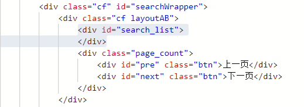
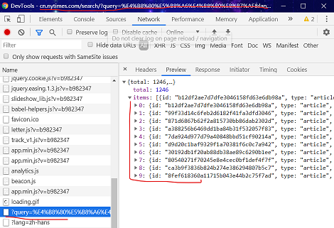
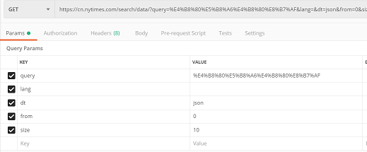
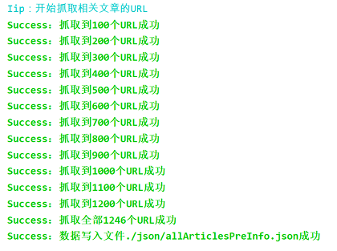
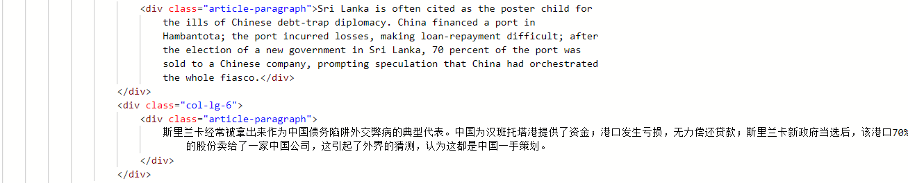
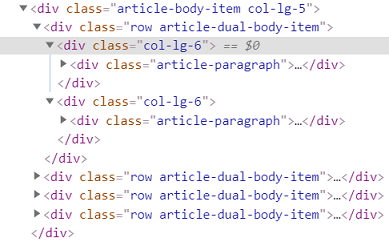
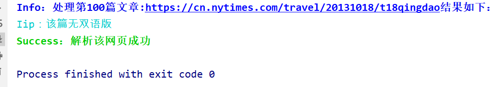
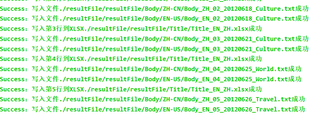

## 前言

或许少侠是从 Github 赶来观看的，那请继续向下看。

如果不是，这是 Github 源码：

<https://github.com/UESTCzhouyuchuan/pythonWromNewYorkTime>

喜欢或者对你有用，请点个 star 哦 :star:。

## 项目背景

因肺炎被迫呆在家中这几天，有个朋友请我帮个忙。因为要建关于一带一路的语料库，从纽约时报([网站](https://cn.nytimes.com/)外网，未翻墙的同学无法访问)爬取关于一带一路的所有中英双语的文章(统计后一共 1426 篇，如果人工去一个一个 copy，啥时候是个头啊)，然后把文章段落放到 TXT 文档中，把文章中英标题、发表时间、类型放到 excel 表格中。

这种费时费力，但有迹可循即有规律的事机器是最合适不过了。说到爬虫，咱第一个想到大`python`

1. python 相关的库也多
2. 语言本身的速度也不慢(至少比俺`js`快多了，说多了落泪)
3. 而且可以多线程(`js`留下了不学无术的眼泪)

而且之前正好做过`python`处理 excel 表格(教程改天出，改天)，所以百分之:100:选`python`。

## 正片开始

在我看来 `爬虫项目` = `找接口挖数据`+`分析html剔数据`+`数据格式化处理`+`数据记录/存储`。

接下来，看我如何一步一步分析、找出这幕后真凶——`数据`。

## 数据在哪里

整个项目初期，我做的一切好像就是在狂喊“数据，你在哪里”“啊，数据，我不是坏人，你在哪里，快出来，哥哥在这”。

### 关键字相关的所有文章

内心 OS:heart:

> 看起来好简单 o，不就是请求 URL，得到返回的 html 文档，提取标签信息不就完了，顶多再加个翻页。

NO!No!No!,俺还是太年轻。拿到请求，一看傻眼了，网页的`preview`下`search-list`下啥也没有，是空的。

这是`postman`得到的数据：



这时 Chrome 开发者查看下的源码：


感觉被坑了有没有。

:::tip
害，还是自己菜，这明明暗示这是动态网页噻。动态网页就是服务器发送过的源 html 会在解析过进程中进一步被 js 脚本处理的网页。
动态网页，那也就说明，这些文章数据是有接口传过来的，那岂不是美滋滋。
:::

开始找接口，打开开发者工具，到 Network 这一栏，`Ctrl+R`重新请求，开始找。



果不其然，接口是/query?data。copy 一下请求 url 放到`postman`中分析一下。



分析结果：

- query:应该是查询的关键字。
- lang：语言？反正是空，不管。
- dt: dataType,设为 json。
- from: 应该是从从第几个文章开始。
- size: 本次数据的个数，经本人测试不能超过，最好设置为 100。

然后写程序`getAllArticlesPreInfo.py`，shuashuashua 拿到全部文章信息，按照需求根据时间排好序，然后写到`allArticlesPreInfo.json`文件中。

运行截图：



代码地址：<https://github.com/UESTCzhouyuchuan/pythonWromNewYorkTime/blob/master/getAllArticlesPreInfo.py>

### 从网页中拿到文章数据

上一节,咱们拿到了所有网页最重要的信息 URL，现在开始分析单篇 URL 中的文章。

再次派上`postman`和开发者工具:

Postman 结果：



开发者工具结果：



这次文章信息老老实实的在 html 中，段落的`class`样式是`article-paragraph`。

然后提取文章段落，中英文标题把文章信息以 json 格式返回出去。

```python
return {
        "isSingle": isSingle,
        "title_ZH": title_ZH,
        "title_EN": title_EN,
        "article_paragraph_ZH":article_paragraph_ZH,
        "article_paragraph_EN":article_paragraph_EN
}
```

写程序`getSingleArticleInfo.py`,运行结果截图：



### 多进程获取全部文章

上一篇讲到如何获得单个页面的文章，这次将如何使用多进程快速获得全部文章信息。

思路如下：

1. 从之前的`allArticlesPreInfo.json`文件中拿到所有文章的 URL 列表(相当于数组)。
2. 把这个数组分成多份，对于每一份，在线程池中为其分配一个线程去获得该数组中全部 URL 的文章，然后把结果以数组的形式返回出来。
3. 拼接所有线程的返回数组，就得到了全部 URL 中的文章信息。
4. 把数据以 json 形式存放到`allArticlesPageInfo.json`文件中。

由于本过程耗时(20 分钟作用，视网络情况)，就不再放出结果图，有兴趣自己运行一下。

这部分在文件`getAllArticlesPageInfo.py`中，详细请看其中代码，[网址](https://github.com/UESTCzhouyuchuan/pythonWromNewYorkTime/blob/master/getAllArticlesPageInfo.py)。

### 把得到的全部文章信息放到文件中。

这块没啥难点，从上面的`allArticlesPageInfo.json`文件中提取出全部文章信息存放的的数组。然后依次放到 TXT 和文件中，放入规则由需求而定。

这部分在文件`_write.py`中,运行截图



## 万剑合一

把所有流程串起来，写入`main.py`中

```python
# -*- coding:utf-8 -*-
# 主函数
from getAllArticlesPreInfo import *
from getAllArticlesPageInfo import *
from _write import *
def main():
    query = "一带一路"
    getAllArticlesPreInfo()
    getAllArticlesPageInfo()
    beginWrite()
if __name__ == "__main__":
    main()
```

---

## 习得独门秘籍

至此，少侠以及习得俺的秘笈。

原创不易，如果学到了东西，麻烦[Github(我是传送门)](https://github.com/UESTCzhouyuchuan/pythonWromNewYorkTime)点一小:star::star:哦，谢谢。

俺也把俺这两天得心血(这两天都在熬夜肝，呜呜呜)给记录下来，感谢你能看到这里，再见哦。:smile:

## 项目注意点：

1. 第一个，因为纽约时报是外网，需要翻墙开 vpn，而且 requests 模块需要开代理。

```python
proxies = {'http': 'http://127.0.0.1:1080', 'https': 'http://127.0.0.1:1080'}
    payload = {}
    headers = {}
    backFix = "dual/"
    realURL = url + backFix
    try:
        response = requests.request("GET", realURL, headers=headers, data=payload, proxies=proxies)
    except Exception as e:
        printError("解析网页" + realURL + str(e))
```

2. 第二个，会存在文章只有中文版，无双语版的情况，要先请求双语版，如果是 notFound，再去请求中文版。

```python
payload = {}
    headers = {}
    backFix = "dual/"
    realURL = url + backFix
    try:
        response = requests.request("GET", realURL, headers=headers, data=payload, proxies=proxies)
    except Exception as e:
        printError("解析网页" + realURL + str(e))
    else:
        doc = pq(response.text)
        notFound = doc("head title")
        isSingle = ''
        # 判断标题是否为notFound
        if (notFound.text() == "页面没有找到 - 纽约时报中文网"):
            isSingle = True
            try:
                response = requests.request("GET", url, headers=headers, data=payload, proxies=proxies)
            except Exception as e:
                printError("解析网页" + url + str(e))
```

3. 在使用多线程拉去全部 URL 的文章时，由于请求数量多难免中间出现网络波动照成请求失败，所以一是要进行错误处理，让程序继续运行下去，二是在后面检查返回的信息是否为 None，如果是重新请求，这样基本可以保证全部请求成功。

```python
def fix(articlesPageInfo,articlesPreInfo):
    index = 0
    sum = 0
    for item in articlesPageInfo:
        if (item == None ):
            url = articlesPreInfo[index]["web_url_with_host"]
            printTip("出现None 需要修复 重新解析网页" + url)
            single_page_info = getURLInfo(url, "")
            articlesPageInfo[index] = single_page_info
            sum += 1;
        index += 1
    return {
        "None": sum,
        "articlesPageInfo": articlesPageInfo
    }
```
